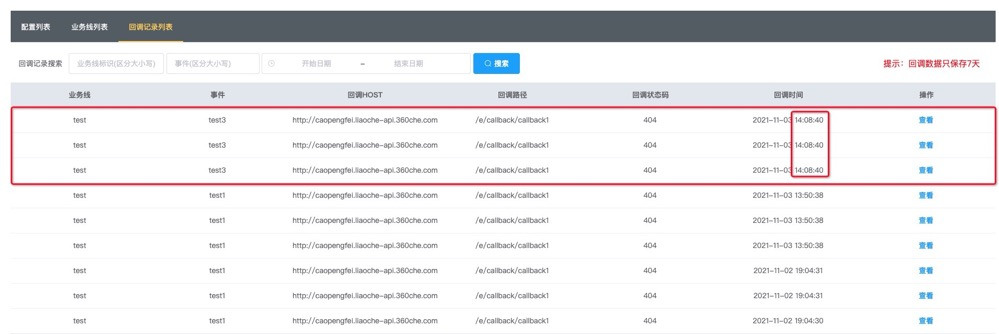

# msg-center
### 项目介绍
该项目是用golang语言，结合mongodb数据库在rabbitmq的基础上前端页面使用vue开发的一个消息队列系统。
### 技术栈及版本
- golang v1.16.3
- rabbitmq v3.8.3
- mongodb v4.2.6
- vue v2.5.17
### 项目实现目的
- 学习golang、vue，初学golang，想用一个实际的项目去更深入的学习和使用。
- 在平时的项目开发中，难免遇到解耦、异步处理，由于业务线众多，每个业务线使用的开发语言也不同，如果每个项目都有自己的一套消息队列，不光重复造轮子浪费时间，同时也不好进行维护。
于是基于次想法，开发了一套可配置化、维护成本低的消息系统。
### 项目流程

### 项目实现特点
- 消息队列可配置化，可根据不同的业务线，不同的消息事件，配置自己对应的消息队列类型。
- 添加和删除配置，系统自己启动消费者以及关闭掉对应的消费者，无需后台重启等操作。
- 结合rabbitmq插件，实现了延时队列，延时以秒为单位，可在发送一条消息时设置延时多少秒之后去消费并回调接口。
### 项目缺陷
- 项目并没有做权限限制，所有的用户都可以访问并增删配置，并调用接口发送消息。
- 现所有接口没有做参数加密。
- 该系统异步解耦只是通过请求 http 接口实现
- 初用golang、vue，代码写的很烂。欢迎大佬的指指点点！
### 系统使用介绍
所有功能的实现都是基于 [rabbitmq](https://www.rabbitmq.com/tutorials/tutorial-one-go.html) 官方文档去实现的。如果不是很了解rabbitmq的话，建议去看看文档了解一下。
#### 项目运行条件
- 服务器要安装rabbitmq、mongodb、golang（不执行编译文件）服务
- 在项目根目录下的config文件夹中有 msgCenterDb.js 文件，该文件中包含了mongodb数据库的collection结构以及测试数据，自行初始化到数据库。
- 延时队列需要用到 rabbitmq 的 rabbitmq_delayed_message_exchange 插件，请自行到 [rabbitmq官方插件](https://www.rabbitmq.com/community-plugins.html) 处进行下载并安装。
#### 项目运行演示
项目启动运行后，程序会从数据库中取出所有配置，然后根据配置去启动不同的消息队列的消费者，通过go协程以阻塞的方式监听队列中的消息。
启动之后的rabbitmq后台的队列列表：  

##### 接口发布消息
发布消息接口：http://localhost:端口号/publish-message  
可接收 get 参数也可接收 post 参数
请求参数：

| 参数名 | 数据类型 | 是否必传 | 在什么情况下必传 | 示例 | 备注 |
|:-----:|:-------:|:------:|:-------------:|:---------:|:----:|
| message | string | 是 | 所有情况 | {"key1":"value1","key2":"value2"} | 要发送的消息 |
| configKey | string | 是 | 所有情况 | project1.event1 | 对应的配置事件，格式为：项目.事件 |
| routingKey | string | 否 | 只有在发布订阅(PublishSubscribe)消息队列类型下，且交换器类型为topic时必传 | routingKey1 | 路径，routingkey |
| delayTime | int | 否 | 只有在发布订阅(PublishSubscribe)消息队列类型下，且交换器类型为x-delayed-message时必传 | 10 | 消息延时时长，单位为秒 |
| headers | string | 否 | 只有在发布订阅(PublishSubscribe)消息队列类型下，且交换器类型为headers时必传 | {"key1":"value1","key3":"abcde"} | headers模式下的匹配key-value，数据格式为json |

请求示例：  
http://localhost:9501/publish-message?configKey=test.test3&message=123&delayTime=10  
我们在 14:08:30 发送一条延时消息，发送成功之后，过10秒钟去回调对应的配置接口。我们可以在系统的回调记录列表后台查看该条消息的消费情况。  
  
我们可以看到，该条消息在 14:08:40 秒进行了回调。

#### 特别说明
- 在添加和删除配置时，系统会自动生成和删除对应的消费者，但需要注意的是在删除配置时关闭相对应的消费者时不会等待队列中的消息消费完成，这样可能会导致消息丢失。请谨慎操作。
- 在删除业务线时，其下对应的配置都会一并删除，同样不会等待消息消费完，也会造成消息丢失。请谨慎操作。
- 在修改业务线name时，程序会先停掉之前的消费者，然后重启消费者，完成时间稍长且会丢失消息。请谨慎操作。
- 如果回调拿到的接口 http code 不为200时，会重新发起回调请求，一共会尝试三次回调。